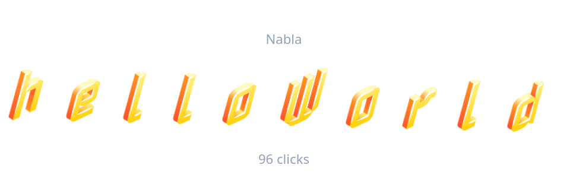

# helloWorld



A one-page Vue 3 experiment. Click anywhere and the heading re-rolls its font
family, weight, slant, letter spacing, rotation and colour — 20 faces spanning
blackletter, pixel, script, typewriter and display.

Built while learning Vue's reactivity model, and the point of it is what *isn't*
there: nothing tells the heading to redraw. `randomize()` assigns a new object to
a `ref`, the template reads that ref, and Vue works out the rest. The smooth
morph between states is CSS, not JavaScript — one `transition-all` class, with
`font-family` snapping because there is no halfway point between two typefaces.

**[Live demo](https://boringhearth.github.io/hello-vue/)**

## Stack

Vue 3 (`<script setup>`), Vite, Tailwind CSS 4.

## Running it

```bash
npm install
npm run dev
```

## Deploying

Pushing to `main` builds and publishes to GitHub Pages via
`.github/workflows/deploy.yml`.
